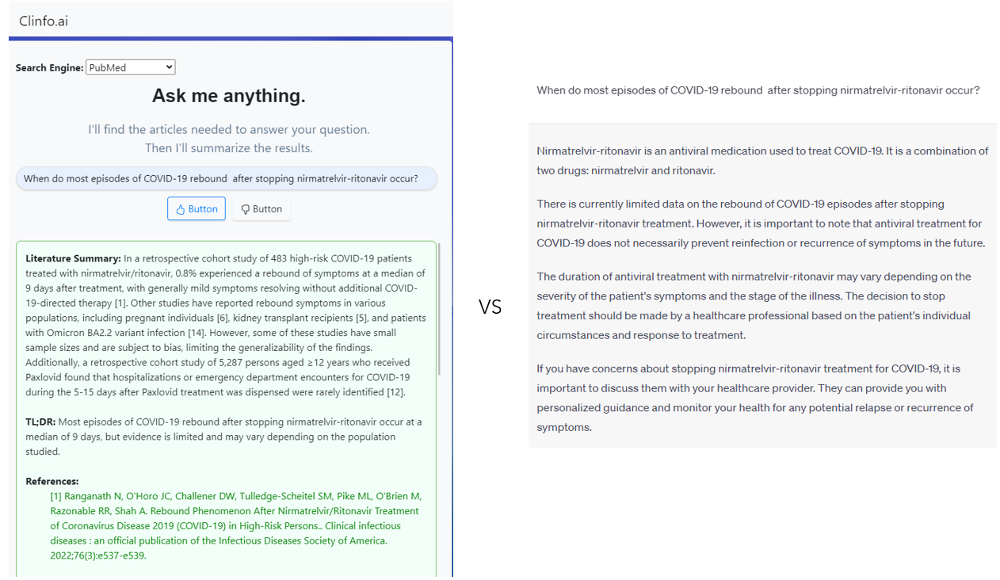

 

Demo: https://clinfo-demo.herokuapp.com/login

Every year, a minimum of 1.8 million new medical articles are published. In the other hand, healthcare professionals are expected to know the latest information. However, with limited time and a broad field to cover, keeping up-to-date can be a challenging task.

Clinfo.AI **searches**and **synthesis** medical literature tailored to  **specific** clinical **question**. By analyzing the context of the inquiry, it identifies and presents the most relevant articles. 

## Comparison of Clinfo.AI vs ChatGPT:

## What type of questions can I ask? 
Questions based on scientific evidence reported in the literature

* Examples:

1. What percentage of patients transmit HIV to their children?

2. When do most episodes of COVID-19 rebound after stopping nirmatrelvir-ritonavir occur?

3. Does magnesium consumption significantly improve sleep quality?

## Type of questions you can’t answer with clinfo.AI
Broad questions: This types of questions could potentially be answered by clinfo.AI, but it is highly probable you won’t get what you are looking for! How to correct this type of question? Provide context!!
Example
1. Chest pain   
Correction: What are the possible causes of chest pain in pediatric patients with no apparent cause? 

  
Questions that would need to reference EHR or patient information: Clinfo.ai can’t access HER lease make sure to provide enough context with your question! 

## How it works?

### IMPORTANT:

1. We plan to relase Clinfo.AI once we have we are done with preliminary testing. 
2. While anyone can use Clinfo.AI, our goal is to augment medical experts not replace them. Read our disclaimer [disclaimer](https://clinfo-demo.herokuapp.com/termsandconditions) and DONOT use clinfo.AI for diagnosis. 
3. If tou woud like to see some functionality or have a comment open an issue request on this repo 

